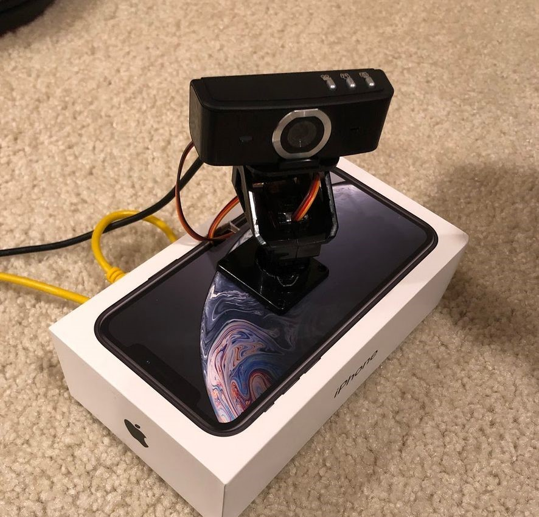
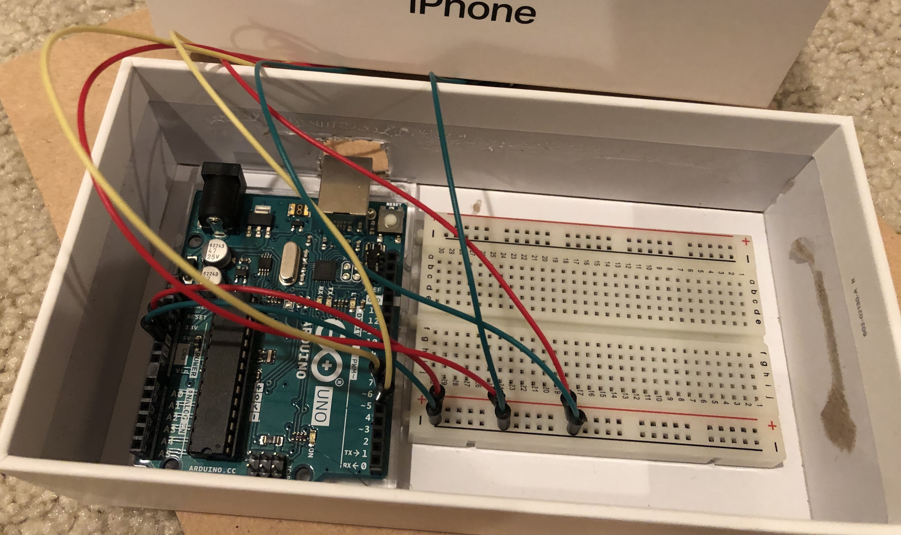
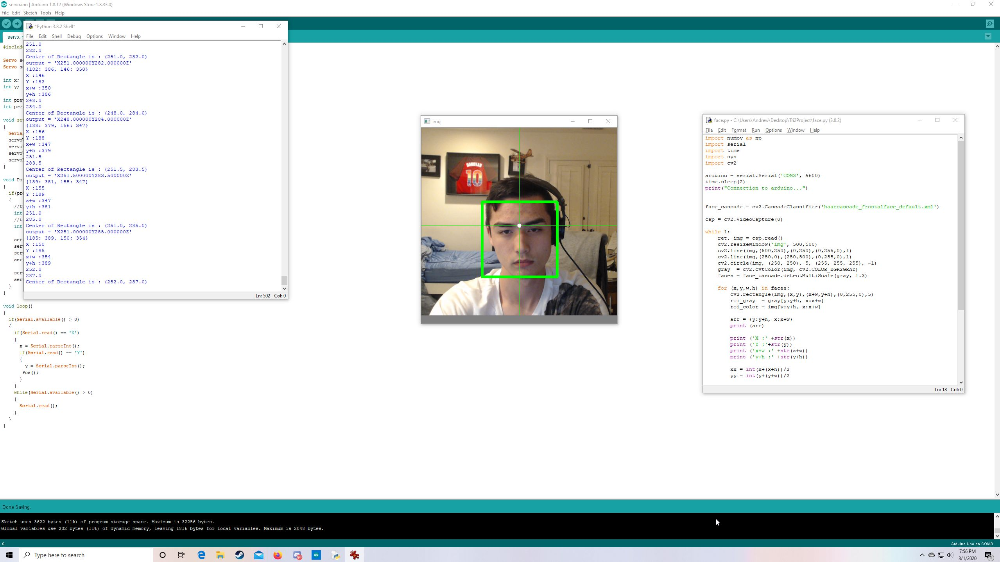

# Face-Tracking-Camera
This is a project I developed in my Engineering Honors class in high school which utilized an Arduino Rev3 and micro servos functioning as a pan-tilt to develop a face tracking camera.

I worked with the open source real-time computer vision library OpenCV for this project which is in C++, but I primarily coded in python. I developed the entire project at a cost of $45.76 which is significantly cheaper than alternative face tracking cameras on the market.

To physically encase the project, I had an iPhone box that I used an exacto knife to cut slits in to fit the wires through in order to connect to the webcam mounted on two micro servos. The two micro servos act as a pan-tilt so the camera can move accordingly when it indentifies a face to keep the face centered in the video. Inside of the iPhone box is the Arduino Rev3 and the breadboard that connects the Arduino to the micro servos. The last hole on the box is to connect the Arduino to my laptop where the code will be run to process the video feed from the webcam along with providing the Arduino with power.

This was one of my first larger projects where I properly documented my work in an engineering notebook and went through a proper design cycle of identifying the problem, researching solutions, identifying specifications, and prototyping. My engineering notebook is in the form of a pdf in this repository if you're interested in seeing more in depth data on my project along with regular progress updates.

The initial planning, designing, development, and any related information can be found in my engineering notebook. It also contains information on any bugs and difficulties along the way and I how I went about solving them.

Here are some pictures of what the final product looked like:

